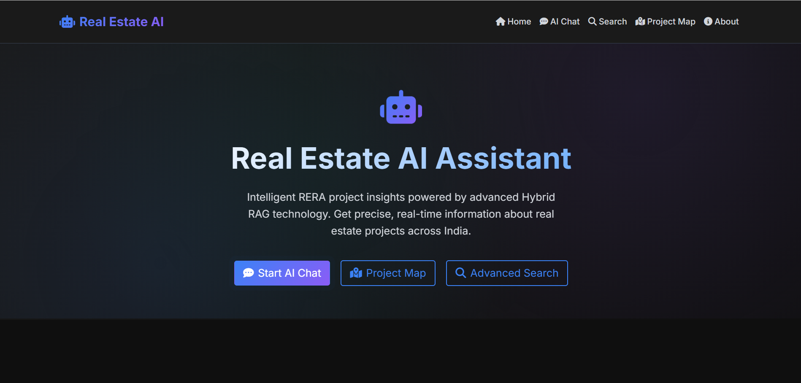
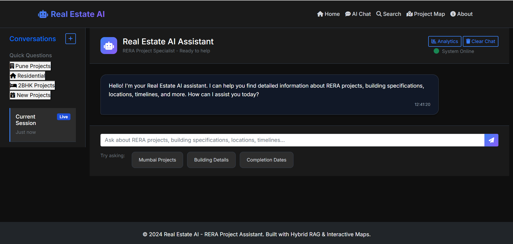
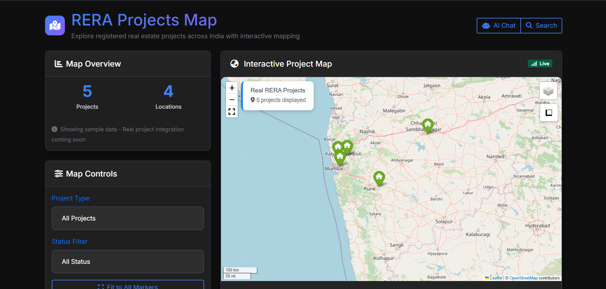
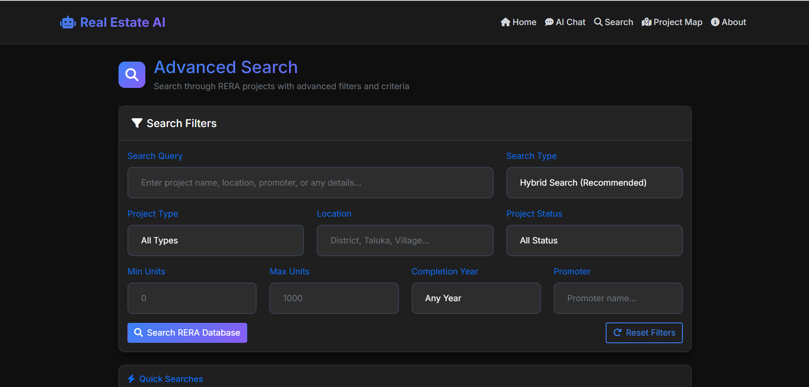

# 🏙️ Real Estate AI – Hybrid RAG System for RERA Project Intelligence

A production-ready **Hybrid RAG (Retrieval-Augmented Generation)** system that processes **RERA real estate project data**, generates ultra-detailed document chunks, builds **dense (FAISS)** and **sparse (BM25)** indexes, and answers queries using an **Adaptive Hybrid Retrieval Router** combined with LLMs.

---

## 🚀 Features

### 🔍 Ultra-Fine-Grained Chunking  
Automatically breaks each RERA project into **micro-level chunks**, including:
- Registration details  
- Project timelines  
- Land & area measurements  
- Promoter information  
- Detailed location (coordinates, boundaries, hierarchy)  
- Building-level micro chunks  
- Apartment-level micro chunks  
- Summaries, quick facts & statistics  

### 📥 JSONL Ingestion  
- Loads large `.jsonl` datasets  
- Handles nested project structures  
- Converts each project into multiple retrievable knowledge chunks  

### 🧠 Dense Embeddings (FAISS)  
- Uses **sentence-transformers/all-mpnet-base-v2**  
- Creates a FAISS vector index at:  
  `models/vector_store.faiss`

### 📚 Sparse Retrieval (BM25)  
- BM25 sparse indexing using `rank_bm25`  
- Custom preprocessing (tokenization, stopword removal)  
- Stored as:  
  `models/vector_store_sparse.pkl`

### 🧬 Hybrid RAG Engine  
- Combines Dense + Sparse retrieval  
- Weighted fusion  
- Configurable adaptive routing:  
  - Dense Weight = 0.6  
  - Sparse Weight = 0.4  
  - Routing threshold = 0.5  

### 🤖 LLM Answer Generation  
Supports multiple model providers:
- OpenRouter  
- HuggingFace Hub  
- OpenAI  
- Ollama (local)

---

# 📂 Project Structure

```bash
real-estate-ai/
├── data/
│   ├── raw/sample_rera_projects.jsonl
│   ├── processed/
│   └── external/
├── src/
│   ├── data_processing/
│   │   ├── data_loader.py
│   │   ├── data_cleaner.py
│   │   └── jsonl_processor.py
│   ├── embedding/
│   │   └── vector_store.py
│   ├── hybrid_rag/
│   │   ├── router.py
│   │   ├── retriever.py
│   │   └── generator.py
│   └── utils/
│       └── helpers.py
├── notebooks/
│   ├── data_exploration.ipynb
│   ├── model_training.ipynb
│   └── testing.ipynb
├── models/
├── config/
│   └── config.yaml
├── web_app/
│   ├── app.py
│   ├── templates/
│   └── static/
├── requirements.txt
├── main.py
└── README.md
```

---

# ⚙️ Installation

### 1. Clone the project
```bash
git clone https://github.com/your-username/real-estate-ai.git
cd real-estate-ai
```

### 2. Create & activate virtual environment (recommended)
```bash
python -m venv .venv
source .venv/bin/activate   # Linux / macOS
# or
.\.venv\Scriptsctivate    # Windows
```

### 3. Install dependencies
```bash
pip install -r requirements.txt
```

---

# 📦 Configuration

All configuration lives in:

```bash
config/config.yaml
```

Example:

```yaml
data:
  raw_path: "data/raw/"
  processed_path: "data/processed/"
  jsonl_file: "data/raw/sample_rera_projects.jsonl"

embedding:
  model_name: "sentence-transformers/all-mpnet-base-v2"
  vector_store_path: "models/vector_store.faiss"

adaptive_rag:
  routing_threshold: 0.5
  dense_weight: 0.6
  sparse_weight: 0.4

models:
  llm: "openrouter"
  embedding: "local"

retrieval:
  max_dense_results: 15
  max_sparse_results: 15
  final_top_k: 8
```

---

# 🛠️ How the Backend System Works

## 1️⃣ Load JSONL File
`JSONLProcessor.load_jsonl_data()`  
- Reads `.jsonl` line by line  
- Loads each project dictionary  

## 2️⃣ Generate Ultra-Detailed Document Chunks
`JSONLProcessor.extract_document_chunks()`  
Produces **50+ fine-grained chunks per project**.

## 3️⃣ Build Dense Vector Index
`VectorStore.build_index()`  
- Loads embedding model  
- Embeds all chunks  
- Saves FAISS index  

## 4️⃣ Build Sparse BM25 Index
`SparseRetriever.build_index()`  
- Preprocess text  
- Tokenize + clean  
- Build BM25 index  

## 5️⃣ Hybrid Retrieval
`router.py` chooses:
- Dense retrieval  
- Sparse retrieval  
- Hybrid weighted fusion  

## 6️⃣ Generate Final Answer
`generator.py` sends the query + retrieved context to the LLM.

---

# ▶️ Running the Backend

### Build all indexes
```bash
python main.py --build-index
```

### Run a query
```bash
python main.py --query "How many projects are under development in Bandra?"
```

### Rebuild vector index
```bash
python main.py --rebuild-vector
```

---

# 📒 Notebooks

- `notebooks/data_exploration.ipynb` → Understand JSONL  
- `notebooks/model_training.ipynb` → Experiment with embeddings  
- `notebooks/testing.ipynb` → Query tests  

---

# 🎨 Frontend Web App (Flask UI)

The `web_app/` folder contains a modern, responsive frontend built with **Flask + Bootstrap 5 + custom CSS**.

## 🌐 Frontend Features

- Landing page with project summary & quick actions  
- AI Chat interface with:
  - Conversation history
  - Quick question buttons
  - Typing indicator
  - Retrieval analytics (documents used, response time, query type, reasoning)
- Advanced Search page with filters:
  - Project type (residential / commercial / mixed)
  - Location (district, taluka, village)
  - Status (under construction, completed, new)
- Interactive RERA Projects Map:
  - Project markers on a Leaflet map
  - Project stats (projects, locations)
  - Legend & quick actions
  - Click on map marker → open AI Chat with pre-filled project query
- About page describing system overview, technology stack and data sources
- Modern theme:
  - Glassmorphism cards
  - Gradients
  - Smooth hover & floating animations

## 🧱 Frontend Structure

```bash
web_app/
├── app.py                 # Flask entry point
├── templates/
│   ├── base.html          # Main layout
│   ├── index.html         # Landing / home page
│   ├── chat.html          # AI chat interface
│   ├── search.html        # Advanced search UI
│   ├── map.html           # RERA projects map
│   └── about.html         # About & system overview
└── static/
    ├── css/
    │   └── style.css      # Modern theme & components
    └── js/
        ├── chat.js        # Chat logic & analytics
        ├── search.js      # Advanced search logic
        └── map.js         # Map interactions & events
```

## 🚀 Running the Frontend

Make sure your backend indexes are built and config is correct, then:

```bash
cd web_app
python app.py
```

By default the app will be available at:

```text
http://localhost:5000
```

Main routes:

- `/` → Home / Landing  
- `/chat` → AI Chat Assistant  
- `/search` → Advanced Search  
- `/map` → RERA Projects Map  
- `/about` → About page  

---

# 🖼️ Screenshots

> 💡 **Tip:** Create a folder called `screenshots/` in the project root and save these images with the filenames shown below.  
> The Markdown paths assume this structure:
> `real-estate-ai/screenshots/rera-1.png` etc.

### 1. Home / Landing Page



---

### 2. AI Chat Assistant



---

### 3. RERA Projects Map



---

### 4. Advanced Search



---

# 🔮 Future Enhancements

- Web UI Dashboard extensions (admin metrics, monitoring)  
- Multi-state RERA data integration  
- Automatic RERA scraping & scheduled refresh  
- Cross-Encoder re-ranking for improved answer quality  
- More advanced geo-spatial visualizations  

---

# 📝 License

MIT License (or update as required)
